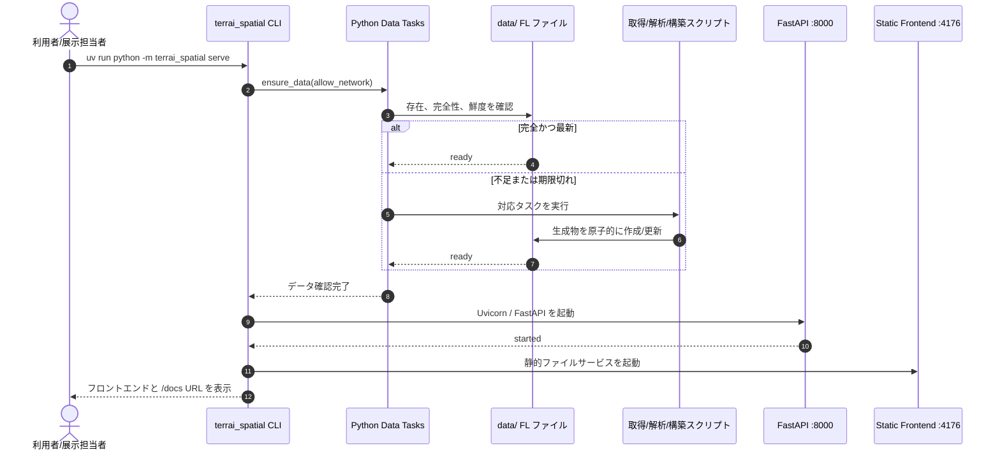
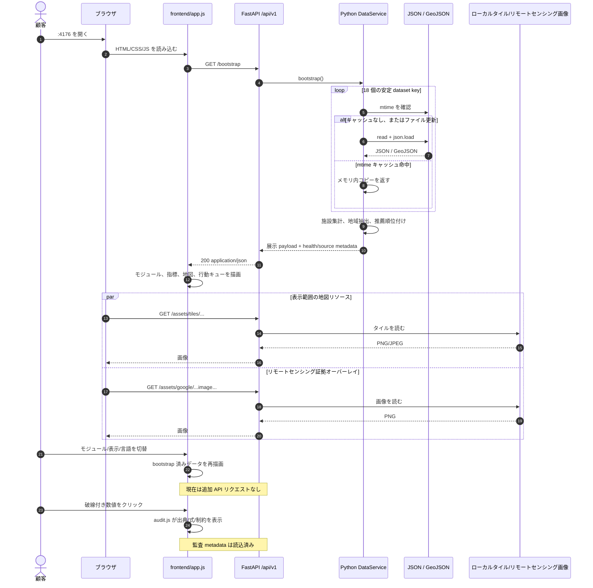
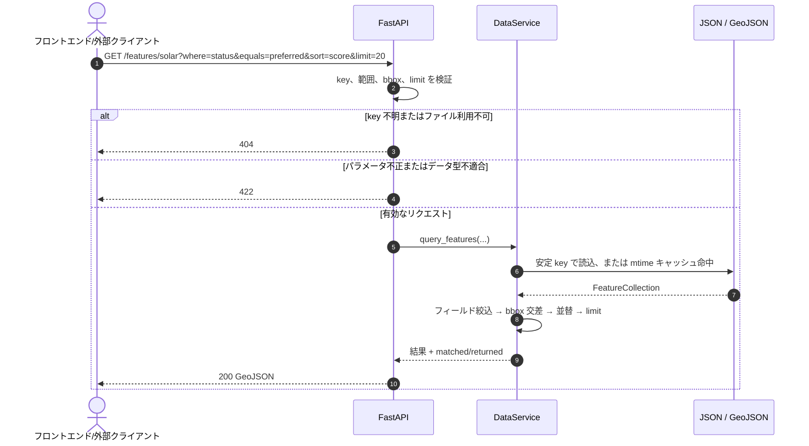

# TerrAI フロントエンド—バックエンド呼び出し構造

[中文](README.md) | [日本語](README.ja.md) | [English](README.en.md)

状態：現在の Demo 実装

更新日：2026-07-21

本書は、顧客向け TerrAI Demo におけるブラウザ、静的フロントエンド、FastAPI、Python データサービス、ファイルベースデータ間の実行時呼び出し構造を説明します。内部の FL → SL → AL 製品概念は `docs/architecture/FL_SL_AL_CONCEPT.ja.md` を参照してください。

## 1. コンポーネントと責務

| コンポーネント | 現在の実装 | 責務 |
|---|---|---|
| 顧客ブラウザ | Chrome、Safari など | ページ読込、モジュール・表示・言語・監査操作 |
| 静的フロントエンド | `frontend/index.html`、`app.js`、`audit.js`、`i18n.js` | 展示 payload を取得し、地図・指標・キュー・三言語 UI を描画。ローカルデータの直接読込、業務結果の計算・並べ替えは行わない |
| FastAPI | `terrai_spatial/api.py` | `/api/v1` HTTP 境界、検証、エラー変換、CORS、OpenAPI、読取専用アセット |
| Python DataService | `terrai_spatial/data_service.py` | 安定 key からファイルを解決し、mtime キャッシュ、検索、地域抽出、集計、推薦キュー順位付けを実施 |
| データタスク | `terrai_spatial/data_tasks.py` と `scripts/` | 起動前に確認・取得・解析・再構築。通常 API リクエスト内では高コスト処理を行わない |
| FL ファイル | `data/**/*.json`、`data/**/*.geojson`、タイル、リモートセンシング画像 | 現在の読取専用ストア。フロントエンド呼び出しを変えずに将来 SQLite へ置換可能 |

既定のローカル待受先：

- フロントエンド：`http://127.0.0.1:4176/`
- API：`http://127.0.0.1:8000/api/v1`
- OpenAPI：`http://127.0.0.1:8000/docs`

`api` クエリパラメータで API origin を上書きできます。

```text
http://127.0.0.1:4176/?api=http://127.0.0.1:9000
```

## 2. 起動時の呼び出し順序

`terrai_spatial serve` はデータ確認と二つの独立 HTTP リスナーを管理します。データが不足・期限切れの場合、タスク登録表が対応する Python スクリプトを実行し、準備完了後にのみフロントエンドと API を起動します。



タスクが失敗すると、`serve` は HTTP サービス起動前に停止し、不足入力または復旧方法を表示します。確認を省くには `--no-ensure-data`、ネットワークを禁止するには `--offline` を使用します。

## 3. 現在の顧客フロントエンドが実際に行うリクエスト

現在の Demo は「一度読み込み、表示をローカル切替」方式です。初回に集約展示契約を一度取得し、モジュール、言語、監査操作では同じ payload を再利用します。地図タイルとリモートセンシング画像は表示範囲に応じて取得します。



## 4. 細粒度 API 検索の呼び出し順序

`/bootstrap` と `/assets/*` のほか、FastAPI は OpenAPI 確認、将来のオンデマンド画面、外部クライアント向けに細粒度 API を提供します。



## 5. エンドポイントと呼び出し元

| エンドポイント | 現在の顧客 UI が呼ぶか | 用途 |
|---|---:|---|
| `GET /api/v1/bootstrap` | はい、起動時に一度 | 全展示データ、サーバー順位付け済みキュー、施設集計、health metadata |
| `GET /api/v1/assets/*` | はい、表示範囲に応じて | ローカル地図タイル、Satellite Embedding 可視化など |
| `GET /api/v1/health` | いいえ、bootstrap metadata に含む | サービスと 18 データセットの独立監視 |
| `GET /api/v1/catalog` | いいえ | 安定 key、ファイル型、件数、更新時刻の確認 |
| `GET /api/v1/datasets/{key}` | いいえ | key で完全な JSON/GeoJSON を取得 |
| `GET /api/v1/features/{key}` | いいえ | フィールド、範囲、bbox、並替、limit による GeoJSON 検索 |
| `GET /api/v1/recommendations/{analysis}` | いいえ、bootstrap に含む | サーバーで抽出・順位付けした行動キューを単独取得 |

## 6. 境界と今後の発展

- API は読取専用で、ブラウザは FL ファイル変更や再構築を起動できません。
- 通常リクエストは取得スクリプトを呼ばず、ページ表示による長時間タスクや外部依存の偶発起動を防ぎます。
- `/bootstrap` は小規模ローカル Demo に適します。規模拡大時は `/features/{key}` と `/recommendations/{analysis}` をモジュール、表示範囲、ページ単位で取得します。
- SQLite 移行時は `/api/v1` のパスと応答意味を維持し、`DataService` 内部の repository/load/query を置き換えます。
- 顧客データ導入時は API の前段に認証、テナント分離、権限監査、バージョン選択が必要です。現 PoC の対象外です。

## 7. コード位置

- フロントエンド API origin と初期要求：`frontend/app.js`
- HTTP ルートとエラー変換：`terrai_spatial/api.py`
- ファイルキャッシュ、検索、集計、キュー：`terrai_spatial/data_service.py`
- 二サービス起動と自動データ確認：`terrai_spatial/cli.py`
- タスク登録と依存関係：`terrai_spatial/data_tasks.py`
- 責務分離の決定：`docs/architecture/FRONTEND_BACKEND_SPLIT.ja.md`
