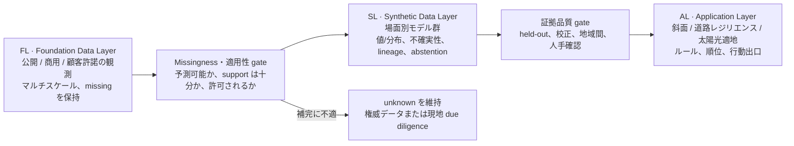

# TerrAI FL → SL → AL 概念アーキテクチャ

[English](FL_SL_AL_CONCEPT.md) | [日本語](FL_SL_AL_CONCEPT.ja.md) | [中文](FL_SL_AL_CONCEPT.zh.md)

状態：Factor of Concept

日付：2026-07-21

## 1. 一文での定義

TerrAI は、許諾された現実証拠を蓄積する **Foundation Data Layer（FL）**、予測可能な missing を場面別モデルと不確実性で非破壊に補う **Synthetic Data Layer（SL）**、適格な証拠を業務 screening・順位・行動出口へ変える **Application Layer（AL）** を採用します。

これは製品と工学の共通言語であり、データ schema や service topology ではありません。

## 2. 今分層する理由

Demo は DEM、遥感表現、建物、道路、公共施設、日射、系統 screening を統合済みです。しかし download data、決定論 feature、heuristic、将来予測を一つの「データ基盤」と呼ぶと、①代理や model 値を観測と誤解する、②各応用が別々の補完を作り顧客学習が共有資産にならない、③マルチスケール missing を再利用可能な技術課題でなく単なるファイル欠落と扱う、という問題が生じます。

FL → SL → AL により「複数の地図 Demo」を「蓄積可能なデータインフラ＋複数応用出口」へ変えます。FL は公開/顧客データ、SL は検証済み場面モデル、AL は顧客課題とともに成長します。

## 3. 三層の概念境界

### FL · Foundation Data Layer

FL は取得した現実証拠と観測意味を維持する決定論的加工を保存します。

- 公開/商用 download data と顧客許諾内部データを含む。
- pixel、点、線、面、対象、近傍、地域、時系列、地下3D sample を扱う。
- missing、時点、coverage、解像度、license 境界を明示する。
- 形式/座標変換、品質検査、DEM からの傾斜計算は FL だが、未観測事実を作らない。
- FL に入った顧客データを顧客間共有するとは限らず、tenant/権限は Factor of Develop で扱う。

現在の GSI、OSM、横浜 open data、NASA POWER、TEPCO 公開 CSV、Google Satellite Embedding は FL です。Embedding は foundation model 由来でも外部生成 FL 表現です。

#### 出典の優先順位と時刻契約

- 全国データと地方データが同じ領域を扱う場合、全国データを coverage の base とします。地方データは一致レコードを独立に検証し、地方属性または明示的に label した補足レコードを加えます。全国レコードを暗黙に上書きしません。
- すべての FL dataset は `retrieved_at` timestamp を持たなければなりません。公開者が公開日、更新日、適用日、観測時点、coverage period を提供する場合は `source_updated_at` などの source-time metadata として別に保持します。提供されない場合は日付を捏造せず、理由付き unknown として記録します。
- 照合後のレコードは、寄与した各 source の provenance と timestamp を保持します。source 間の不一致は review 対象として見える状態にし、定期更新では「最後に取得したものが自動的に正しい」とせず timestamp と内容差分を比較します。

### SL · Synthetic Data Layer

SL は予測可能と判断した missing に対する FL 上の非破壊拡張です。

- FL 観測を上書きせず observed、synthetic、unresolved を区別する。
- 最小可信出力は値/分布、適用範囲、不確実性、model identity、lineage。
- support 不足、domain shift、過大不確実性では abstention を許す。
- データ型、空間構造、尺度、context 密度、顧客場面別の model portfolio を使う。
- 所有権、法定許認可、正式系統接続、構造安全は権威手続・現地調査で取得し synthetic 回帰で埋めない。

### AL · Application Layer

AL は適格 FL/SL 証拠を場面別 screening、順位、警告、portfolio 分析、行動へ変えます。

- 現在は斜面 exposure、道路レジリエンス、太陽光適地、統合分析。
- 場面ルール、weight、停止条件、UI、人手確認を担当する。
- synthetic を観測として再包装せず、不確実性と abstention を隠さない。
- 同じ SL は複数 AL に再利用でき、AL は証拠に応じ FL 直接利用、適格 SL、現地データ要求を選べる。

## 4. Missing data はマルチスケール

| 尺度 | missing の例 | 概念処理 |
|---|---|---|
| pixel/voxel | 雲、画像なし、地下 sample なし | 時空 context model、または unknown |
| 対象 | 屋根 label なし、道路点検なし | 類似する完全対象から転移し support を開示 |
| 近傍 | 施設圏内 label が少数 | random 行結合でなく coherent 近傍を使う |
| 地域 | 一都市だけ高品質 layer がある | 地域間適用性を検証してから転移 |
| 時間 | 更新頻度差、履歴断絶 | 時点と外挿を明示し旧値を現観測としない |
| 法律/工学 | 所有、許認可、正式系統、耐力 | synthetic 補完せず権威調査を起動 |

目的は空白ゼロ地図ではなく、安全に縮小できる gap と残すべき unknown の分離です。

## 5. SL の機構証拠としての `geo_pfn`

`TsumiNa/geo_pfn` は地下機構証拠で、地表応用の精度証明ではありません。commit `07c7ee0` の羽田実験では：

- 240 borehole、3,521 specimen。48 query 孔を固定し残り192から 3–192 complete context 孔を抽出。
- 座標+深度で 2M geo-PFN は N=25/50 に約20.1/20.7 RMSE、TabICL は約26.3/24.0。特定中疎域で coherent context が有効。
- 密で最良の model が疎でも最良とは限らず、大 model は極端疎で過外挿し得る。密度別選択と abstention が必要。
- N=3 の宣言90%区間は約91.0%を coverage するが、LCSG は N≤6 で軽い過信、N≥25 で保守的、行単位不確実性と誤差の相関も弱い。
- 「実 feature が悪化」は後続実験で主に under-training と修正された。残課題は feature 取込、疎目的学習、interval sharpness、cross-site 検証。

よって coherent unit、疎密度/場面別 model、分布と abstention、完全対象 held-out・強 baseline・地域間検証を原則とします。

## 6. 現 Prototype の実成熟度

| 層 | 状態 | 存在 | 未存在 |
|---|---|---|---|
| FL | 接続済み | open data 取得、local cache、multiscale 観測、出典/license | 顧客 private data import、統一権限/version governance |
| SL | 概念定義済み、地表 SL なし | 独立 `geo_pfn` 機構・校正証拠 | 横浜/茂原 label 学習補完、地域間検証、本番 model portfolio |
| AL | Demo 接続済み | 斜面、道路、施設、太陽光、開発制約、統合 queue | 検証済 SL を使う正式応用、顧客業務 loop |

現在の risk、suitability、opportunity、joint score は AL の透明 heuristic で SL 予測ではありません。屋根容量や service area 代理も「補完済み事実」ではありません。

## 7. Demo → PoC → MVP gate

| 段階 | SL ができること | AL 取込条件 |
|---|---|---|
| Demo | FL/SL/AL 境界と `geo_pfn` 機構証拠 | 地表 synthetic を業務 score に入れない |
| PoC | 少数顧客 label で model 群を学習し HGBT、空間補間、TabICL/geo-PFN と比較 | 完全対象 held-out、疎密度別誤差、校正区間、明示 abstention |
| MVP | 許諾範囲で安定 SL を生成し drift 監視、人手確認 | 時間/地域間検証、version/rollback、顧客閾値、human sign-off |

## 8. 明示的非目標

本概念は FL/SL/AL schema、層間 API/event/orchestration/model registry、DB/store 技術、具体地表補完 model、本番推論、顧客権限/課金/deployment/tenant 間学習、全 AL の SL 利用方式を固定しません。第一顧客 PoC で目的変数、欠測機構、risk threshold、検証 protocol が明確になった後に決めます。

## 9. 参照証拠

- `TerrAI_Narrative_Product_Strategy_Update_v4.docx`：§4 の疎地下予測は局所入口証明、§6–7 は共有 engine/delivery/application と held-out/uncertainty 要件。
- [`TsumiNa/geo_pfn`](https://github.com/TsumiNa/geo_pfn)、確認 commit `07c7ee0`。
- [`sparse-context-results.html`](https://github.com/TsumiNa/geo_pfn/blob/main/docs/sparse-context-results.html) と [`stage-report.html`](https://github.com/TsumiNa/geo_pfn/blob/main/docs/stage-report.html)。
