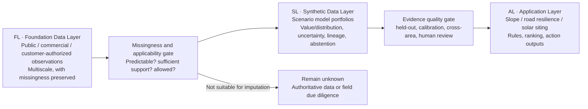

# TerrAI FL → SL → AL Conceptual Architecture

[English](FL_SL_AL_CONCEPT.md) | [日本語](FL_SL_AL_CONCEPT.ja.md) | [中文](FL_SL_AL_CONCEPT.zh.md)

Status: Factor of Concept

Date: 2026-07-21

## 1. One-sentence definition

TerrAI uses a **Foundation Data Layer (FL)** to accumulate authorized real-world evidence, a **Synthetic Data Layer (SL)** to non-destructively augment predictable missing data with scenario-specific models and uncertainty, and an **Application Layer (AL)** to turn qualified evidence into business screening, ranking, and action outputs.

This is a shared product/engineering language, not a data schema or service topology.

## 2. Why separate the layers now

The Demo already combines DEM, remote-sensing representations, buildings, roads, public facilities, solar climate, and grid-screening signals. Calling downloaded data, deterministic features, heuristics, and future predictions one “data foundation” creates three problems:

1. Users may mistake proxies or model values for observations.
2. Each application may build separate imputation logic, preventing models and customer learning from becoming shared assets.
3. Multiscale missingness is treated as missing files instead of a reusable TerrAI technical problem.

FL → SL → AL reframes several map demos as an accumulative data infrastructure plus application outputs. FL grows with open/customer data, SL with validated scenario models, and AL with customer problems.

## 3. Conceptual boundaries

### FL · Foundation Data Layer

FL stores acquired real-world evidence and deterministic transformations that preserve its observational meaning.

- Sources include downloadable public/commercial data and customer-authorized internal data.
- Scales include pixels, points, lines, polygons, objects, neighborhoods, regions, time series, and subsurface 3-D samples.
- Missingness, dates, coverage, resolution, and license boundaries remain explicit.
- Format conversion, coordinate normalization, quality checks, and deterministic slope from DEM remain FL; they do not invent unobserved facts.
- Customer data entering FL is not automatically shared across customers; tenancy and permissions are later Factor of Develop work.

Current FL includes GSI, OpenStreetMap, Yokohama open data, NASA POWER, TEPCO public CSV, and Google Satellite Embedding. The embedding remains external FL even though it was produced by a foundation model.

#### Source precedence and time contract

- When a national dataset and a local dataset cover the same domain, TerrAI uses the national dataset as the coverage base. Local data independently validates matching records and adds local attributes or explicitly labelled supplemental records; it never silently overwrites the national record.
- Every FL dataset must carry a `retrieved_at` timestamp. When the publisher supplies a publication, update, effective, observation, or coverage time, FL preserves it separately as source-time metadata such as `source_updated_at`; if the publisher supplies none, FL records the value as unknown with a reason instead of inventing a date.
- Reconciled records retain the provenance and timestamps of every contributing source. Source disagreements remain visible for review, and periodic refreshes compare timestamps and content rather than treating the latest download as automatically authoritative.

### SL · Synthetic Data Layer

SL is a non-destructive augmentation over FL for missing data judged predictable.

- Never overwrite FL observations; observed, synthetic, and unresolved remain distinguishable.
- The minimum credible output is a value/distribution plus scope, uncertainty, model identity, and lineage.
- Abstention is valid when support is insufficient, domain shift is excessive, or uncertainty is high.
- Use model portfolios specialized by data type, spatial structure, scale, context density, and customer scenario.
- Ownership, statutory permission, formal grid access, and structural safety must come from authoritative processes or field due diligence, not synthetic regression.

Conceptually, AL consumes one evidence view while retaining the identity of every observed, synthetic, and unresolved value.

### AL · Application Layer

AL turns qualified FL/SL evidence into scenario-specific screening, ranking, alerts, portfolio analysis, and actions.

- Current outputs include slope exposure, road resilience, solar siting, and joint analysis.
- AL owns scenario rules, weights, stop conditions, UI, and human review.
- It must not repackage synthetic values as observations or hide uncertainty/abstention.
- One SL capability may serve several ALs; an AL may use FL directly, qualified SL, or require field data depending on evidence completeness.

## 4. Missing data is multiscale

| Scale | Example missingness | Conceptual treatment |
|---|---|---|
| Pixel/voxel | Cloud, absent imagery, no subsurface sample | Spatiotemporal context model or remain unknown |
| Object | Building lacks roof label; road lacks inspection | Transfer from similar complete objects and disclose support |
| Neighborhood | Few labels inside a facility service area | Use coherent neighborhoods, not randomly combined rows |
| Region | One city has a high-quality layer and another does not | Validate cross-area applicability before transfer |
| Time | Different refresh rates or historical gaps | Record time and test extrapolation; never call stale values current observations |
| Legal/engineering | Ownership, approval, formal grid access, load capacity | Never impute; trigger authoritative investigation |

The goal is not a map without blanks, but separating gaps that can safely be narrowed from unknowns that must remain.

## 5. `geo_pfn` as mechanism evidence for SL

`TsumiNa/geo_pfn` is subsurface mechanism evidence, not proof of accuracy for current surface applications. In the Haneda experiment at repository commit `07c7ee0`:

- The test bed has 240 boreholes and 3,521 specimens. The sparse protocol fixes 48 query holes and samples 3–192 complete context holes from the remaining 192.
- With coordinate+depth features, 2M geo-PFN reaches about 20.1/20.7 RMSE at N=25/50 versus about 26.3/24.0 for TabICL, supporting coherent structured context in a specific medium-sparse regime.
- The dense-best model is not necessarily sparse-best. Larger models can over-extrapolate under extreme sparsity, supporting density-dependent model selection or abstention.
- At N=3, a declared 90% interval covers about 91.0%, but LCSG is slightly overconfident at N≤6, conservative at N≥25, and row-level uncertainty remains weakly correlated with error. Calibration must be validated by scenario and sparsity.
- Later training corrected the earlier claim that real features inherently hurt; the main issue was under-training. Remaining gaps are feature uptake, sparse-target training, interval sharpness, and cross-site validation.

Four principles follow: use coherent units as context; select models by sparsity and scenario; output distributions and abstention boundaries; require complete-object held-out tests, strong baselines, and cross-area validation.

## 6. Actual Prototype maturity

| Layer | State | Present | Absent |
|---|---|---|---|
| FL | Integrated | Open-data downloads, local caches, multiscale observations, provenance/licenses | Private-customer import and unified permission/version governance |
| SL | Concept defined; no surface SL | Independent `geo_pfn` mechanism and calibration evidence | Yokohama/Mobara label-trained imputation, cross-area validation, production model portfolio |
| AL | Demo integrated | Slope, road, facility, solar, development constraints, and joint queues | Formal applications consuming validated SL and closed-loop customer workflows |

Current risk, suitability, opportunity, and joint scores are transparent AL heuristics, not SL predictions. Roof capacity and service-area proxies are not “imputed facts.”

## 7. Demo → PoC → MVP gates

| Stage | SL may do | Condition for AL admission |
|---|---|---|
| Demo | Show the FL/SL/AL boundary and `geo_pfn` mechanism evidence | No surface synthetic value enters business scores |
| PoC | Train scenario portfolios on small customer label sets; compare HGBT, spatial interpolation, TabICL/geo-PFN baselines | Complete-object held-out, errors by sparsity, calibrated intervals, explicit abstention zones |
| MVP | Generate SL within authorized data scope, monitor drift, preserve human review | Cross-time/area validation, version/rollback, customer-approved thresholds, human sign-off |

## 8. Explicit non-goals

This concept does not fix:

- FL/SL/AL file, table, object, or field schemas;
- inter-layer APIs, events, orchestration, model registry, or online/offline protocols;
- database, object store, feature store, vector store, or multitenant technology;
- a specific surface-imputation model, training set, or production inference;
- customer permissions, billing, deployment, or cross-tenant learning;
- whether every AL must consume one shared SL or its fallback rules.

These choices follow the first customer-data PoC after its target variable, missingness mechanism, risk threshold, and validation protocol are known.

## 9. Evidence

- `TerrAI_Narrative_Product_Strategy_Update_v4.docx`: §4 treats sparse subsurface prediction as a local entry proof; §6–7 define shared engine, delivery, applications, held-out, and uncertainty requirements.
- [`TsumiNa/geo_pfn`](https://github.com/TsumiNa/geo_pfn), reviewed at `07c7ee0`.
- [`sparse-context-results.html`](https://github.com/TsumiNa/geo_pfn/blob/main/docs/sparse-context-results.html) and [`stage-report.html`](https://github.com/TsumiNa/geo_pfn/blob/main/docs/stage-report.html).
