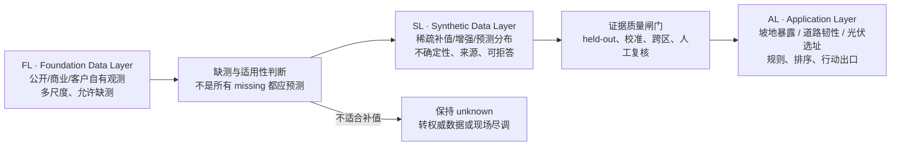

# TerrAI FL → SL → AL 概念架构

状态：Factor of Concept（概念重构）  
日期：2026-07-20  
适用范围：TerrAI Spatial Intelligence Prototype

## 1. 一句话定义

TerrAI 将可获得的真实世界证据组织为 Foundation Data Layer（FL），用经过验证的场景化稀疏预测模型在 FL 的缺测处形成可审计的 Synthetic Data Layer（SL），再由 Application Layer（AL）把合格证据转化为坡地暴露、道路韧性、光伏选址等决策出口。

这是一套产品与工程共同使用的概念语言，不是本次要落地的数据 schema 或服务拓扑。

## 2. 为什么现在要分层

当前 Demo 已能把 DEM、遥感表征、建筑、道路、公共设施、太阳辐照和电网筛查结果放进同一平台，但“下载数据”“确定性派生特征”“启发式评分”“未来模型预测”容易在叙述中被统称为数据底座。这样会产生三个问题：

1. 事实与预测边界不清，用户可能把代理值或模型补值理解成原始观测。
2. 每个应用都可能各自做一套补值，无法把模型改进和客户数据积累沉淀为共享资产。
3. 多尺度 missing data 被当成文件缺失，而不是 TerrAI 可复用的核心技术问题。

FL → SL → AL 将商业叙事从“几个地图 Demo”改成“一个可积累的数据基础设施，加多个应用出口”：FL 随开放数据和客户数据增长，SL 随场景模型与验证增长，AL 则按客户问题扩张。

## 3. 三层的概念边界

### FL · Foundation Data Layer

FL 保存现实世界中实际获得的证据及不改变其观测语义的确定性加工。

- 来源包括可下载的公开/商业数据，以及商业化后客户授权导入的内部数据。
- 尺度可以是像素、点、线、面、对象、邻域、区域、时间序列或地下三维采样。
- FL 允许并且必须如实保留 missing、时点差异、覆盖差异、分辨率差异和许可边界。
- 格式转换、坐标统一、质量检查、从 DEM 计算坡度等确定性测量仍属于 FL；它们不能凭空填补未观测事实。
- 客户数据进入 FL 不代表它会被跨客户共享。租户隔离、权限和商业条款属于后续 Factor of Develop。

当前 Demo 中的 GSI、OpenStreetMap、横滨市开放数据、NASA POWER、东京电力公开 CSV 与 Google Satellite Embedding 均属于 FL。Satellite Embedding 是外部生产的观测表征，不因为它来自基础模型就自动成为 TerrAI 的 SL。

### SL · Synthetic Data Layer

SL 是构建在 FL 上的非破坏性增强层，用于在经过判断后对可预测的 missing data 进行补值或扩充。

- SL 不能覆盖或改写 FL 中的观测事实，而应让 observed、synthetic 与 unresolved 在概念上始终可区分。
- SL 不只是点估计；其最小可信输出是预测值或分布、适用范围、不确定性、模型身份和来源链。
- SL 允许模型拒答。缺少支持、跨域过远或不确定性过大时，正确结果可以是继续 missing。
- SL 面向模型群而非单一万能模型。模型可按数据类型、空间结构、尺度、上下文密度和客户场景定制。
- 不是所有缺失信息都适合生成 synthetic 数据。地权、法定许可、正式并网容量、结构安全结论等必须由权威流程或现场尽调补齐，不能因技术上可回归就被模型“填满”。

从产品视角，SL 可以理解为覆盖在 FL 之上的增强证据视图：已有观测保持 FL 身份，通过质量闸门的补值标为 synthetic，无法回答的部分保持 unresolved。AL 因而可以消费一个统一入口，同时仍知道每个值到底来自观测还是推断。

### AL · Application Layer

AL 将 FL/SL 提供的合格证据转化为特定业务场景中的筛查、排序、告警、组合分析和行动建议。

- 当前出口包括坡地暴露筛查、道路韧性、光伏设施选址及其联合分析。
- AL 负责场景规则、权重、停止条件、用户界面和人工复核流程。
- AL 不应把 synthetic 值重新包装成原始数据，也不能隐藏 SL 的不确定性或拒答。
- 同一个 SL 能力可以服务多个 AL；同一个 AL 也可以按证据完整度直接使用 FL、使用通过闸门的 SL，或要求补充现场数据。

## 4. Missing data 是多尺度问题

TerrAI 所说的 missing 不限于表格空单元格：

| 层级 | 可能的 missing | 概念处理 |
|---|---|---|
| 像素/体素 | 云、无影像、无地下采样 | 时空上下文模型，或保持未知 |
| 对象 | 某建筑无屋顶标签、某道路无巡检记录 | 从相似完整对象迁移，披露支持度 |
| 邻域 | 设施服务圈内只有少数标注 | 用 coherent 邻域作为上下文，而非随机拼行 |
| 区域 | 一个城市有高质量层，另一区域没有 | 先做跨区适用性验证，不直接复制分数 |
| 时间 | 更新频率不同、历史断档 | 标明时点并评估时间外推，不把旧值当当前观测 |
| 法律/工程结论 | 地权、审批、正式并网、结构承载缺失 | 不进入 synthetic 补值；触发权威调查 |

这种划分让“是否预测”先于“用哪个模型”。SL 的价值不是让地图无空白，而是把能够安全缩小的信息缺口与必须保留的未知分开。

## 5. geo_pfn 对 SL 的机制证据

`TsumiNa/geo_pfn` 提供的是地下数据上的机制证据，不是当前地表应用的精度证明。基于仓库 `07c7ee0` 的羽田实验：

- 真实测试床为 240 个钻孔、3,521 个试样；稀疏协议固定留出 48 个查询孔，从其余 192 个孔抽取 3–192 个完整上下文孔。
- 在仅坐标与深度的中等稀疏区间，2M geo-PFN 在 N=25/50 的 RMSE 约为 20.1/20.7，TabICL 约为 26.3/24.0，说明结构化 coherent context 在特定稀疏区间有价值。
- “稠密最优模型”不等于“稀疏最优模型”：较大模型在极稀疏上下文可能过度外推，支持未来 SL 按上下文密度选择模型或拒答，而不是固定一个模型覆盖所有区域。
- N=3 时，模型声明的 90% 区间实际命中约 91.0%，但 LCSG 在 N≤6 仍有轻微过度自信；N≥25 又偏保守，且逐行不确定性与实际误差的相关性仍弱。校准必须按场景和稀疏度验证。
- 早期“加入真实特征会变差”的判断已被后续训练实验修正为主要是训练不足；当前真正的缺口是特征摄取、稀疏目标训练、区间锐度和跨站点验证。这说明模型结论应版本化，不能成为静态产品真理。

由此得到 SL 的四项概念原则：使用 coherent 单元作为上下文；按稀疏度与场景选择模型；输出分布与可拒答边界；以完整对象 held-out、强基线和跨区验证作为准入条件。

## 6. 当前 Prototype 的真实成熟度

| 层 | 当前状态 | 已存在 | 尚未存在 |
|---|---|---|---|
| FL | 已接入 | 开放数据下载、本地缓存、多尺度观测、来源与许可记录 | 客户私有数据导入、统一权限与版本治理 |
| SL | 概念已定义；地表 Demo 尚未接入 | `geo_pfn` 提供独立地下稀疏预测与校准机制证据 | 对横滨/茂原本地标签训练的补值、跨区验证、生产模型群 |
| AL | Demo 已接入 | 坡地暴露、道路韧性、设施韧性、光伏选址、开发约束与联合队列 | 使用经验证 SL 的正式应用、客户工作流和工程闭环 |

特别说明：当前页面中的风险分、适宜分、机会分和联合分是 AL 的透明启发式计算，不是 SL 的稀疏预测。屋顶容量、服务圈等代理也不能被重新命名为“已补值事实”。

## 7. Demo → PoC → MVP 的 SL 闸门

| 阶段 | SL 可以做什么 | 进入 AL 的条件 |
|---|---|---|
| Demo（当前概念） | 展示 FL/SL/AL 边界与 `geo_pfn` 机制证据 | 不把任何地表 synthetic 值加入业务评分 |
| PoC | 用客户少量标签训练候选模型群，比较 HGBT、空间插值、TabICL/geo-PFN 等基线 | 完整对象 held-out、按稀疏度报告误差、校准区间、明确拒答区 |
| MVP | 在授权数据范围内稳定生成 SL，监控分布漂移并保留人工复核 | 跨时间/跨区验证、版本与回滚、客户接受的风险阈值和人工签核 |

## 8. 本次明确不做

以下问题留给 Factor of Develop，不在本次 PR 中提前固化：

- FL、SL、AL 的文件、表、对象或字段 schema；
- 层间 API、事件、任务编排、模型注册和在线/离线服务协议；
- 数据库、对象存储、特征库、矢量库或多租户技术选型；
- 具体地表补值模型、训练数据和生产推理实现；
- 客户数据权限、计费、部署和跨租户学习机制；
- 各 AL 是否必须消费统一 SL，以及具体 fallback 策略。

这些开发决策需要在第一个客户数据 PoC 明确目标变量、缺测机制、风险阈值和验证协议后再做。

## 9. 参考证据

- `TerrAI_Narrative_Product_Strategy_Update_v4.docx`：§4 将稀疏地层参数预测定义为进入 Cyber Port 的局部技术证明而非完整产品；§6–7 定义共享 engine、delivery、application 与 held-out/uncertainty 要求。
- [`TsumiNa/geo_pfn`](https://github.com/TsumiNa/geo_pfn)，复核提交 `07c7ee0`。
- [`sparse-context-results.html`](https://github.com/TsumiNa/geo_pfn/blob/main/docs/sparse-context-results.html) 与 [`stage-report.html`](https://github.com/TsumiNa/geo_pfn/blob/main/docs/stage-report.html)。

