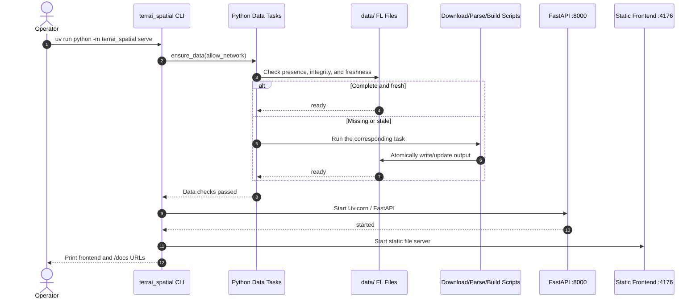
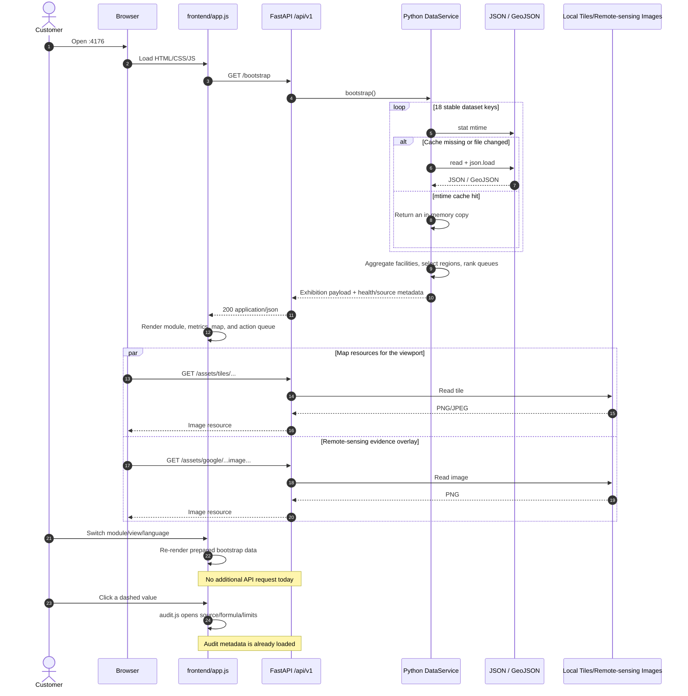
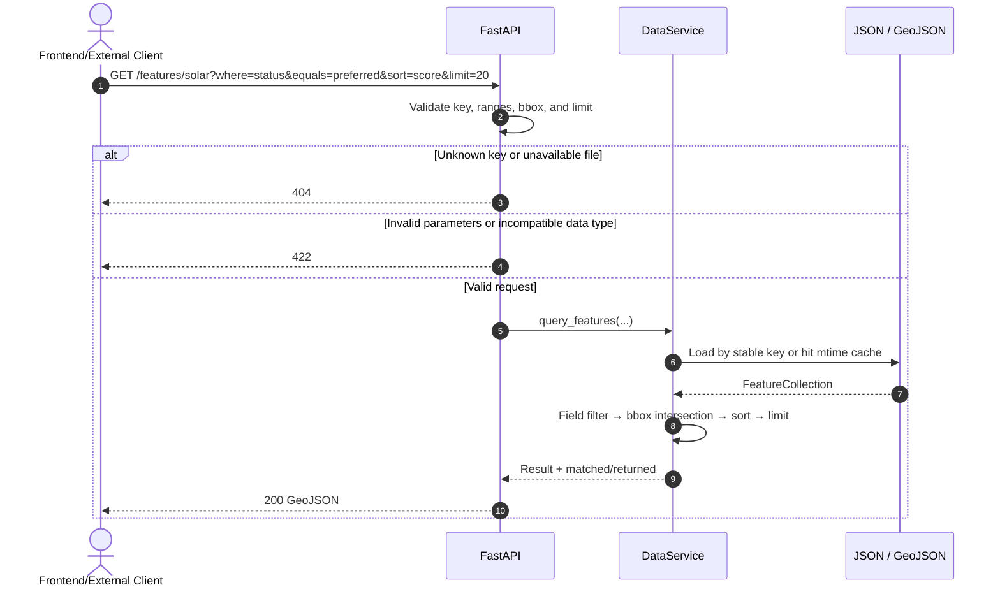

# TerrAI Frontend–Backend Architecture and Call Structure

[中文](FRONTEND_BACKEND.md) | [日本語](FRONTEND_BACKEND.ja.md) | [English](FRONTEND_BACKEND.en.md)

Status: current Demo implementation

Updated: 2026-07-21

This document describes the runtime call structure of the customer-facing TerrAI Demo: how the browser, static frontend, FastAPI service, Python data service, and file-backed data interact. See `docs/architecture/FL_SL_AL_CONCEPT.en.md` for the internal FL → SL → AL product concept.

## 1. Components and responsibilities

| Component | Current implementation | Responsibility |
|---|---|---|
| Customer browser | Chrome, Safari, etc. | Load the page and trigger module, view, language, and audit interactions |
| Static frontend | `frontend/index.html`, `app.js`, `audit.js`, `i18n.js` | Request the exhibition payload and render maps, metrics, queues, and the trilingual UI; never read local data files or calculate/sort business results |
| FastAPI | `terrai_spatial/api.py` | Provide the `/api/v1` HTTP boundary, validation, error mapping, CORS, OpenAPI, and read-only assets |
| Python DataService | `terrai_spatial/data_service.py` | Resolve stable keys to files, cache by mtime, query/filter, aggregate, and rank recommendation queues |
| Data tasks | `terrai_spatial/data_tasks.py` and `scripts/` | Check, download, parse, and rebuild data before startup; never run expensive jobs inside normal API requests |
| FL files | `data/**/*.json`, `data/**/*.geojson`, tiles, and remote-sensing images | Current read-only store; can later be replaced by SQLite without changing frontend calls |

Default local listeners:

- Frontend: `http://127.0.0.1:4176/`
- API: `http://127.0.0.1:8000/api/v1`
- OpenAPI: `http://127.0.0.1:8000/docs`

Override the API origin with the frontend `api` query parameter:

```text
http://127.0.0.1:4176/?api=http://127.0.0.1:9000
```

## 2. Startup call sequence

`terrai_spatial serve` coordinates the data check and two independent HTTP listeners. The task registry invokes the relevant Python script when data is missing or stale; the frontend and API start only after data is ready.



If a data task fails, `serve` stops before starting HTTP services and reports the missing input or recovery action. Use `--no-ensure-data` to skip the check or `--offline` to forbid network access.

## 3. Actual customer-frontend request sequence

The current Demo follows a “load once, switch views locally” strategy. The first page load requests one aggregated exhibition contract. Module, language, and audit interactions reuse that payload. Map tiles and remote-sensing images are fetched on demand for the current viewport.



## 4. Fine-grained API query sequence

Besides `/bootstrap` and `/assets/*`, FastAPI exposes smaller endpoints for OpenAPI inspection, future on-demand frontend loading, and external clients.



## 5. Endpoints and callers

| Endpoint | Called by the current customer UI? | Purpose |
|---|---:|---|
| `GET /api/v1/bootstrap` | Yes, once at startup | All exhibition data, server-ranked queues, facility aggregates, and health metadata |
| `GET /api/v1/assets/*` | Yes, by viewport | Local map tiles, Satellite Embedding visualizations, and other binary evidence |
| `GET /api/v1/health` | No; embedded in bootstrap metadata | Independently monitor the service and 18 datasets |
| `GET /api/v1/catalog` | No | Inspect stable keys, file types, record counts, and update times |
| `GET /api/v1/datasets/{key}` | No | Retrieve a complete JSON/GeoJSON dataset by key |
| `GET /api/v1/features/{key}` | No | Query GeoJSON by field, range, bbox, sort, and limit |
| `GET /api/v1/recommendations/{analysis}` | No; results are embedded in bootstrap | Retrieve one server-filtered and ranked action queue |

## 6. Boundaries and evolution

- The API is read-only; the browser cannot modify FL files or trigger rebuilds.
- Normal requests do not invoke download scripts, preventing a page view from starting a long job or external dependency.
- `/bootstrap` suits the small local Demo. At larger scale, load `/features/{key}` and `/recommendations/{analysis}` by module, viewport, and page.
- A SQLite migration should replace the repository/load/query internals of `DataService` while preserving `/api/v1` paths and response semantics.
- Customer data requires authentication, tenant isolation, authorization audit, and version selection in front of the API; these are outside the current PoC.

## 7. Code map

- Frontend API origin and startup request: `frontend/app.js`
- HTTP routes and error mapping: `terrai_spatial/api.py`
- File cache, queries, aggregates, and queues: `terrai_spatial/data_service.py`
- Dual-service startup and automatic data checks: `terrai_spatial/cli.py`
- Task registry and dependencies: `terrai_spatial/data_tasks.py`
- Refactor rationale and implementation plan: `docs/refactor/fl-sl-al-platform/01-exhibition-fastapi-pr1b.md`
