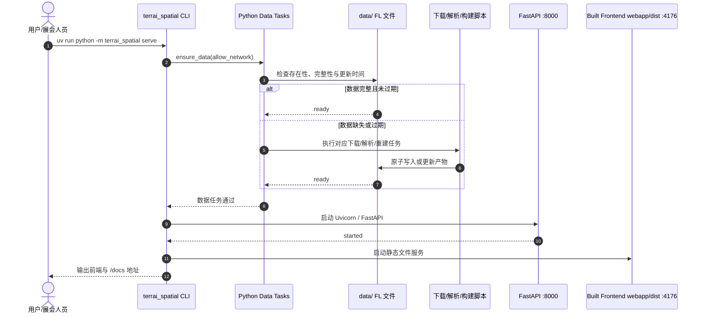
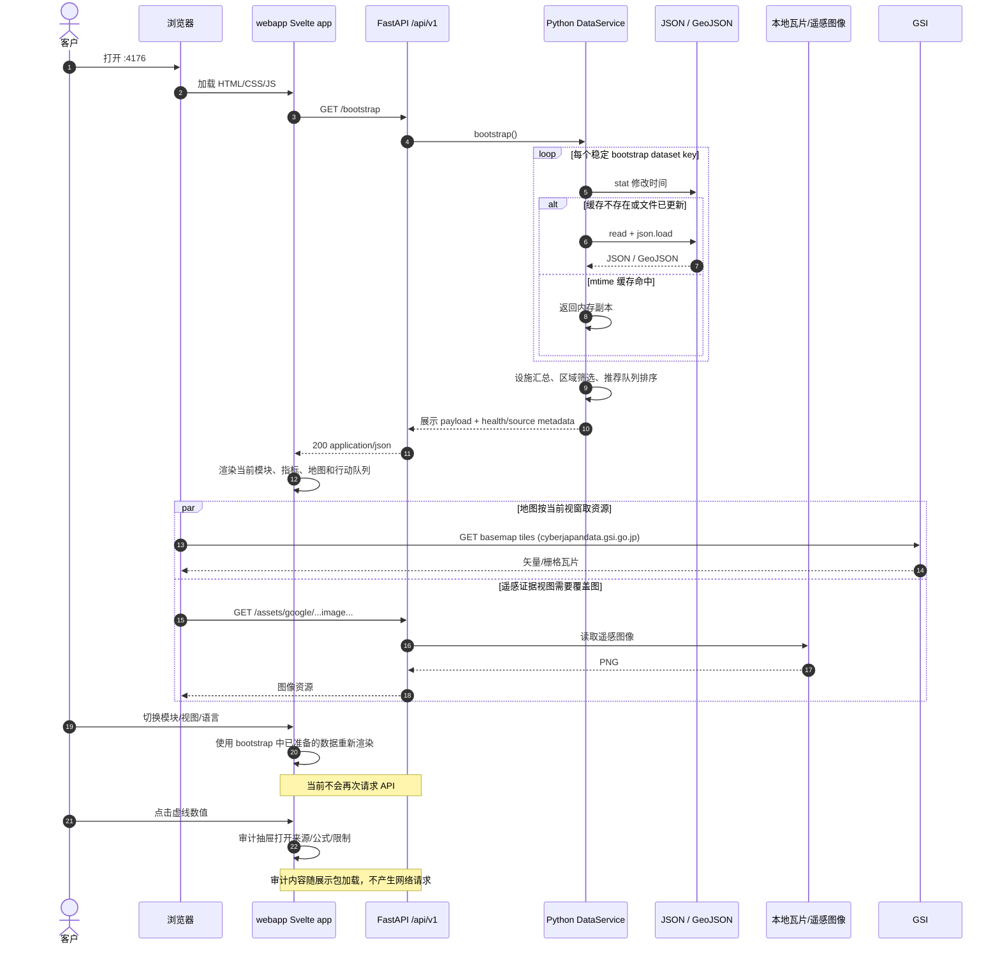
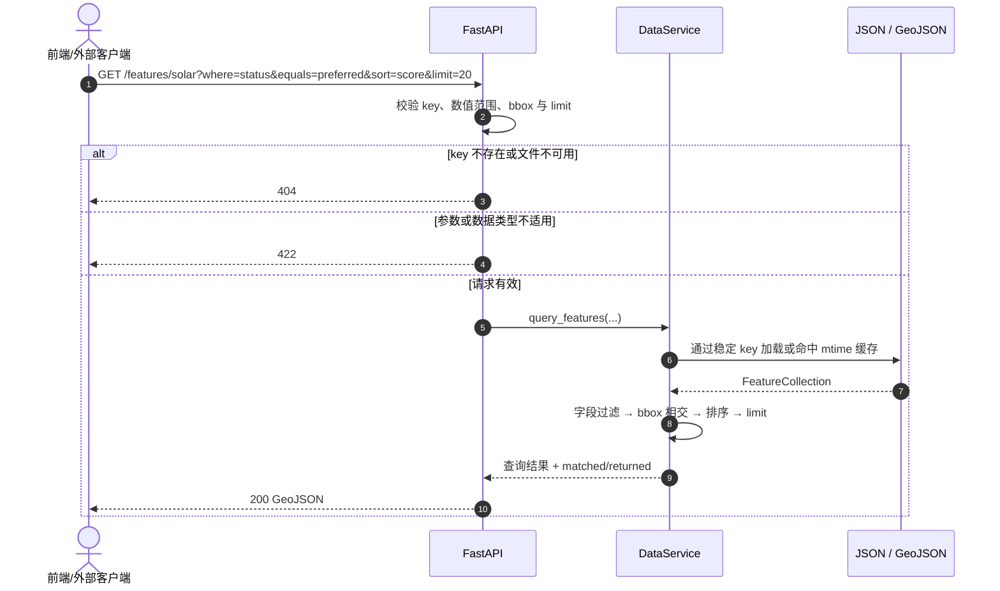

# TerrAI 前端—后端架构与调用结构

[English](FRONTEND_BACKEND.md) | [日本語](FRONTEND_BACKEND.ja.md) | [中文](FRONTEND_BACKEND.zh.md)

状态：当前 Demo 实现

更新日期：2026-07-21

本文描述客户展示版 TerrAI 的**运行时调用结构**。它关注浏览器、构建后的 Svelte 前端、FastAPI、Python 数据服务和文件数据之间如何交互；内部 FL → SL → AL 产品概念见 `docs/architecture/FL_SL_AL_CONCEPT.md`。

## 1. 组件与职责

| 组件 | 当前实现 | 职责 |
|---|---|---|
| 客户浏览器 | Chrome / Safari 等 | 加载页面、触发模块切换和审计交互 |
| Svelte 前端 | `webapp/`（Svelte 5 + Vite；`terrai serve` 提供构建后的 `webapp/dist`） | 请求展示数据，渲染 MapLibre + deck.gl 地图、指标、队列、审计抽屉和编译期校验的三语界面；不读取本地数据文件，不计算或排序业务结果 |
| FastAPI | `terrai_spatial/api.py` | 提供 `/api/v1` HTTP 边界、参数校验、错误码、CORS、OpenAPI 和只读资产服务 |
| Python 数据服务 | `terrai_spatial/data_service.py` | 用稳定 key 定位文件，按修改时间缓存，执行查询、区域筛选、汇总与推荐队列排序 |
| 数据任务 | `terrai_spatial/data_tasks.py` 与 `scripts/` | 启动前检查、下载、解析和重建数据；不在普通 API 请求中执行昂贵任务 |
| FL 文件 | `data/**/*.json`、`data/**/*.geojson`、瓦片与遥感图像 | 当前只读数据存储；未来可由 SQLite 替换而不改变前端调用方式 |

本地默认监听：

- 前端：`http://127.0.0.1:4176/`
- API：`http://127.0.0.1:8000/api/v1`
- OpenAPI：`http://127.0.0.1:8000/docs`

前端可用 URL 参数 `api` 覆盖 API origin，例如：

```text
http://127.0.0.1:4176/?api=http://127.0.0.1:9000
```

## 2. 启动调用顺序

`terrai_spatial serve` 会在 `webapp/dist` 不存在时拒绝启动（先执行 `cd webapp && npm run build`），然后在一个开发命令中管理数据检查和两个独立 HTTP 服务。数据缺失或过期时，统一任务注册表调用对应 Python 脚本；数据可用后才启动前端和 API。



若数据任务失败，`serve` 会在启动 HTTP 服务前停止并报告缺失输入或恢复方法。`--no-ensure-data` 可跳过检查；`--offline` 可禁止联网。

## 3. 当前客户前端的真实请求顺序

当前页面采用“一次加载、客户端切换视图”的 Demo 策略：首屏只请求一次聚合展示契约，之后的模块切换、语言切换和审计抽屉不再次查询后端。地图瓦片及遥感图片按浏览器视窗按需加载。



## 4. API 查询调用顺序

除当前页面使用的 `/bootstrap` 和 `/assets/*` 外，FastAPI 还提供细粒度接口，供 API 文档验证、后续按需加载页面或外部客户端使用。



## 5. 接口与调用方

| 接口 | 当前客户页面是否调用 | 主要用途 |
|---|---:|---|
| `GET /api/v1/bootstrap` | 是，首次加载一次 | 返回全部展示数据、服务端推荐队列、设施汇总和健康元数据 |
| `GET /api/v1/assets/*` | 是，按地图视窗调用 | 返回本地地图瓦片、Satellite Embedding 可视化等二进制资源 |
| `GET /api/v1/health` | 否，包含在 bootstrap metadata | 独立监控服务和全部数据集的就绪状态 |
| `GET /api/v1/catalog` | 否 | 审查稳定 key、文件类型、记录数和更新时间 |
| `GET /api/v1/datasets/{key}` | 否 | 按 key 获取完整 JSON/GeoJSON |
| `GET /api/v1/features/{key}` | 否 | 按字段、范围、bbox、排序与 limit 查询 GeoJSON |
| `GET /api/v1/recommendations/{analysis}` | 否，结果已包含在 bootstrap | 单独取得服务端筛选和排序后的行动队列 |

## 6. 边界与后续演进

- API 当前只读；浏览器不能修改 FL 文件或触发数据重建。
- 普通请求不调用下载脚本，避免一次页面访问意外产生长任务或外部依赖。
- 当前 `/bootstrap` 适合小型本地 Demo。数据量增长后，前端应改用 `/features/{key}` 与 `/recommendations/{analysis}` 按视窗、模块分页加载。
- 迁移 SQLite 时，应替换 `DataService` 内部 repository/load/query 实现，保持 `/api/v1` 路径和响应语义稳定。
- 加入客户数据后，需要在 API 前增加认证、租户隔离、授权审计与版本选择；这些不属于当前 PoC。

## 7. 代码定位

- 前端 API origin 与带类型的启动请求：`webapp/src/lib/api/client.ts`、`webapp/src/App.svelte`
- 地图实例、底图与 deck.gl 图层：`webapp/src/lib/map/`
- 审计记录与消息目录：`webapp/src/lib/audit.ts`、`webapp/src/lib/i18n/messages.ts`
- HTTP 路由与错误映射：`terrai_spatial/api.py`
- 文件缓存、查询、汇总与队列：`terrai_spatial/data_service.py`
- 启动双服务与自动数据检查：`terrai_spatial/cli.py`
- 数据任务注册和依赖：`terrai_spatial/data_tasks.py`
- 前后端职责与调用结构已合并保留在本文；重构过程见英文 [`fl-sl-al-platform`](../refactor/fl-sl-al-platform/00-overview.md)。
