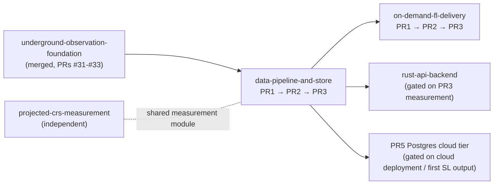

# Data Pipeline and Store

- Status: Completed — PR1–PR3 delivered; PR4 and PR5 stay gated on their recorded triggers and were deliberately not part of the executed sequence

## Context

The data path grew one script at a time, and it shows. Nineteen standalone scripts totalling
over 4,000 lines each carry their own copy of the infrastructure they need:

- **Eight HTTP download implementations** with six different User-Agent strings and retry
  logic in exactly one of them (`fetch_tepco_grid.py:55-78`). Every other fetcher — including
  all four underground scripts merged in PRs #31-#33 — dies on the first transient error.
- **Five JSON-writing conventions.** Some outputs are pretty-printed with a trailing newline,
  some minified without one, some written atomically via a temp file and some not — determined
  solely by which script produced them.
- **The study window encoded four times** in three coordinate orderings and two different
  extents (`build_multiscale_evidence.py:21`, `fetch_google_satellite_embedding.py:44`,
  `fetch_visual_tiles.py:28`, `fetch_mlit_foundation.py:27`).
- **Two copies of the planar geometry kit that disagree with each other**:
  `build_joint_analysis.py:18` uses reference latitude 35.4465, `build_multiscale_evidence.py:17`
  uses 35.446. Distances behind published scores depend on which script computed them.
- **Three copies of the GeoJSON validity check**, three spellings of the `retrieved_at`
  timestamp, two zip-extraction hardening strategies, two streamed sha256 helpers.

The underground scripts also supplied the strongest evidence that a shared library is the
right move: rather than copying, `fetch_plateau_uc24_13.py:18-41` imports nine helpers from
`fetch_plateau_uc24_16.py`, and `fetch_osm_sapporo_underground.py:16` imports its atomic
writer. A de-facto pipeline library already exists — it is just homed inside one fetch script,
where `build_underground_scenes.py:47` still re-implemented the atomic writer rather than
import from a sibling fetcher. PR1 promotes that library to a real one.

Storage is flat GeoJSON committed to git: 68 MB of it under `data/mlit/`, the largest single
file 24 MB, now joined by the underground manifests, audit indexes, and scene handoffs under
`data/plateau/` and `data/scenes/`. Serving reads whole files: `load` (`data_service.py:99-108`)
deserializes and caches by mtime but returns a **deep copy of the entire collection on every
access**, and `query_features` (`data_service.py:267`) filters by linear scan, walking every
vertex of every feature to rebuild bounding boxes per query (`_intersects_bbox`, `:346`), then
deep-copies the full collection a second time (`:298`) to attach the filtered subset. A bbox
query that touches five features pays for all 31,132.

This holds at 87 MB. The stated trajectory — underground 3D Tiles packages, more MLIT layers,
more regions — reaches hundreds of megabytes and beyond, and three consequences arrive with it:
queries become interactive-latency failures, every refresh rewrites multi-megabyte git blobs,
and the frontend's only options remain "everything in bootstrap" or "nothing at all".

The direction is already recorded. `docs/refactor/rust-api-backend/00-overview.md` names the
storage and query layer as the thing to fix and measure **before** any language rewrite, and
`docs/architecture/FRONTEND_BACKEND.md:167` reserves exactly this move: "a SQLite migration
should replace the repository/load/query internals of `DataService` while preserving `/api/v1`
paths." This refactor is that work, staged.

## Decision

Three changes, in dependency order.

**One pipeline library.** A single `terrai_spatial/pipeline/` package owns what every script
currently reimplements: HTTP download with one User-Agent, one timeout policy, retry with
backoff, and streamed sha256; atomic JSON/GeoJSON writing; the GeoJSON validity check; safe zip
extraction; the provenance timestamp format; and a **study-area registry** defining each region's
bbox once, in one coordinate convention, with named variants where a wider acquisition context is
genuinely intended rather than accidental.

**One queryable store.** A spatially indexed SQLite database, built deterministically from the
normalized GeoJSON by a data task, **gitignored, never committed**. Geometry is stored as the
GeoJSON the API already returns, properties as JSON, per-feature bounding boxes in an R-tree.
GeoJSON remains the canonical interchange and provenance format in git; the store is a derived
artifact, rebuilt on clone by `ensure_data` like any other derived output.

The schema is designed once, at the concept level, for the database this project is actually
heading toward — not for the demo alone. The recorded trajectory is cloud deployment on GCP
with persistent SL prediction data; the designated cloud backend is Cloud SQL for PostgreSQL
with PostGIS, and the local SQLite store and the future Postgres tier implement the same
conceptual schema behind the same store interface. Three commitments follow:

- **Rebuildable versus authoritative decides migration policy.** The FL store is derived: a
  schema change is a version-stamp bump and a rebuild, never a migration file. Migration
  tooling becomes load-bearing only with the first authoritative table — data not reproducible
  from committed files, which the SL layer's model outputs will be. That tooling is plain
  forward-only SQL files applied by a small in-repo runner, not a framework.
- **No ORM, at any layer.** The query surface is narrow, hand-written SQL behind the
  `DataService` seam is directly reviewable and greppable — which matters more, not less, when
  the code is AI-written — and plain SQL survives the recorded Rust direction where ORM
  semantics would not. The dialect differences that an abstraction layer would claim to hide
  (JSON functions, spatial predicates) are exactly the ones it cannot, so they are confined to
  one module and pinned by tests instead.
- **The FL → SL → AL data-model commitment is schema, not convention.** Every dataset row
  carries its tier and its observed/synthetic/unresolved evidence state. SL prediction sets,
  when they arrive, enter the same `features` table under a model-run record rather than a
  parallel structure, so windowed queries serve FL and SL layers through one path.

**The service reads the store.** `DataService.query_features` becomes an indexed lookup instead
of a scan; `load` stops deep-copying collections it hands out. The `/api/v1` contract — paths,
keys, response shapes — does not change at all. The before/after latency measurement this
produces is the first of the three entry conditions the Rust plan demands.

The scaling step beyond that — moving large FL layers out of git entirely, onto the cached
acquisition-plus-manifest pattern the underground refactor already established — is staged last
and gated on measured need, not taken preemptively.

## Alternatives considered

### GeoPackage instead of plain SQLite

Rejected for the serving store, kept available for export. GeoPackage's flat typed columns would
force encoding, because FL features carry nested provenance dicts in `properties`, and its
geometry encoding would put a WKB-to-GeoJSON conversion on every response the API currently
serves verbatim. The store exists to serve the existing contract fast, not to be opened in QGIS;
the committed GeoJSON already serves the interop role. If a customer needs GeoPackage, it is an
export task, not the store.

### GeoParquet plus DuckDB

Rejected for now. Columnar scan speed answers analytical aggregation, which no current query
performs; the actual query pattern is windowed feature retrieval, which is an index problem.
It would add a heavy dependency where SQLite is in the standard library, and it weakens the
recorded Rust option, which reads SQLite trivially.

### FlatGeobuf per dataset

Rejected. Its packed R-tree serves bbox streaming well but there is no attribute filtering, and
`query_features` supports `where`/`equals`/`minimum`/`maximum` today. Two retrieval mechanisms
would survive where one suffices.

### Vector tiles (PMTiles) as the store

Rejected. Tiles answer rendering, not feature queries; the audit drawer needs whole features
with full properties. Tiling remains a presentation-layer option on top of the store, already
deferred in `on-demand-fl-delivery` with the trigger recorded.

### PostgreSQL with PostGIS from day one

Rejected as the local store, adopted as the cloud tier. Offline operation is a recorded
must-survive constraint — the exhibition runs on a laptop with no network — and Postgres-first
would either put Cloud SQL in the demo path or put Docker in the clone-and-run path. The
migration pain the two-backend split creates is bounded deliberately: one conceptual schema,
dialect-paired SQL confined to the store module, and one shared table-driven semantics suite
run against both backends. That suite, not an early Postgres adoption, is the actual insurance
that the cloud tier behaves like the tier the demo was tested on.

### Commit the SQLite store to git

Rejected. A binary blob diffs as a full rewrite on every refresh — the exact churn this refactor
is trying to stop, made worse. Determinism plus `ensure_data` gives every clone the same store
without git carrying it.

### Rewrite the scripts as one framework

Rejected. The scripts' `main()` structure, their per-source quirks, and their one-task-one-script
mapping into `data_tasks.py` are fine. What is duplicated is infrastructure, not structure.
Extracting the library and leaving the scripts as thin source-specific logic is the smallest
change that removes the copies.

## Scope

- The shared pipeline library and migration of all acquisition and build scripts onto it.
- The store schema, its deterministic build task, and its manifest.
- `DataService` internals moved onto the store behind the unchanged public contract, with
  before/after measurements.
- A staged, gated path for moving large FL layers from committed GeoJSON to cached acquisition.

## Non-goals

- **No API contract change.** Paths, dataset keys, query parameters, and response shapes are
  frozen throughout. The Rust plan calls the public contract load-bearing; this refactor treats
  it that way.
- No new analysis, score, or frontend behavior. The frontend consumer of windowed queries is
  `on-demand-fl-delivery`'s scope; this refactor makes those queries cheap.
- No raster or 3D storage. Tiles stay XYZ files served statically; underground 3D Tiles stay
  native per the underground plan. The store covers vector FL and derived JSON products.
- No Rust. This is the measurement-and-data-layer work that plan requires first.
- No change to what the two analysis scripts compute. Measurement correctness is
  `projected-crs-measurement`; the library gives its measurement module a home but does not
  change formulas.

## Consequences

- Adding a data source stops meaning copying a download wrapper, a writer, a bbox, and a
  timestamp format. The per-source script shrinks to what is actually source-specific.
- The two-extent, two-latitude ambiguity about what "the study area" means is forced into the
  open: the registry can only be written by deciding which numbers are correct.
- Every fetcher gains retry behavior; today's single-transient-failure aborts stop.
- Queries stop paying for collection size. The API's windowed endpoint becomes cheap enough for
  `on-demand-fl-delivery` PR1 to rely on at 68 MB and beyond.
- `ensure_data` gains a store-build step, and a fresh clone pays it once. Offline operation is
  preserved: the store builds from committed files with no network.
- The Rust option gets its entry-condition measurement, and the seam it depends on —
  `data_service.py` as the only component that knows where data lives — is reinforced rather
  than eroded.
- Two representations of vector FL exist, GeoJSON in git and SQLite on disk. The build task and
  its manifest are the guarantee they agree; the manifest records source hashes so drift is
  detectable rather than silent.

## Sequencing

The `underground-observation-foundation` refactor merged as PRs #31-#33, adding four scripts
(`fetch_plateau_uc24_16.py`, `fetch_plateau_uc24_13.py`, `fetch_osm_sapporo_underground.py`,
`build_underground_scenes.py`) and four data tasks; PR1 here migrates them along with the rest
and is no longer blocked on them. The `projected-crs-measurement` refactor is independent and
may land first; whichever lands second hosts the shared measurement module inside the pipeline
library.

Across refactors: `on-demand-fl-delivery` PR1 should be implemented after PR3 here so its
windowed client hits indexed queries rather than linear scans, and `rust-api-backend` stays
unplanned until PR3's measurement answers whether a rewrite is still solving a real problem.

## Delivery plan

- [01-shared-pipeline-library-pr1.md](01-shared-pipeline-library-pr1.md): the library, all
  scripts migrated, outputs proven unchanged.
- [02-spatial-store-pr2.md](02-spatial-store-pr2.md): the store schema, build task, and manifest.
- [03-store-backed-service-pr3.md](03-store-backed-service-pr3.md): `DataService` on the store,
  contract frozen, latency measured.
- [04-large-layer-cache-migration-pr4.md](04-large-layer-cache-migration-pr4.md): large FL layers
  out of git, gated on measured need.
- [05-postgres-cloud-tier-pr5.md](05-postgres-cloud-tier-pr5.md): the same schema on Cloud SQL
  PostgreSQL with PostGIS, gated on cloud deployment being scheduled or the first authoritative
  table arriving.
