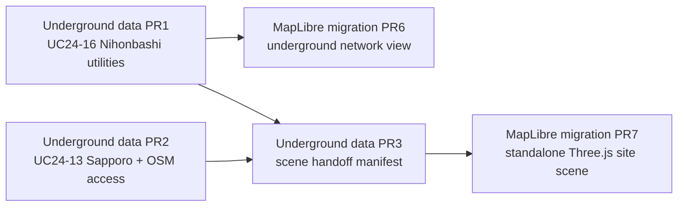

# Underground Observation Foundation

- Status: Planned
- Date: 2026-07-21
- Type: Foundation Data Layer acquisition and renderer handoff
- Upstream datasets: Project PLATEAU UC24-16, Project PLATEAU UC24-13, OpenStreetMap
- Downstream plans: `docs/refactor/maplibre-migration/06-underground-networks-pr6.md` and `07-site-scene-three-pr7.md`

## Context

The MapLibre migration reached parity and retired Leaflet, but its two capability stages remain blocked because there is no subsurface dataset to render. The available open data does not form one geographically complete underground twin:

- UC24-16 provides 2024 demonstration models of water, sewer, gas, communications, power and access structures in limited areas of Nihonbashi, Nagoya and Osaka.
- UC24-13 provides 2024 demonstration models of underground public spaces around Sapporo, Shibuya and Takamatsu stations.
- OpenStreetMap can supplement public subway tracks, entrances and underground pedestrian ways, but it is community-maintained and neither validates nor completes the PLATEAU models.

The best minimum pair is therefore deliberately split across two canonical scenes: **Nihonbashi** for utilities and **Sapporo Station** for underground public space and access. They must never be overlaid as if they were one place. Other published areas remain discoverable reference resources until a later application needs them.

UC24-16 representative archives inspected during planning are standard 3D Tiles 1.1 packages containing `tileset.json` and glTF. Their glTF uses `EXT_structural_metadata`; observed fields include `uro:minDepth`, `uro:maxDepth`, `uro:outerDiamiter`, `uro:material`, `uro:length`, `uro:mesureType`, source-description fields and feature identifiers. `uro:outerDiamiter` and `uro:mesureType` are the exact misspelled upstream property keys and must be preserved verbatim during extraction; normalized aliases may be added separately but must never replace the source keys. Archive metadata does not publish file sizes through CKAN, although direct HTTP metadata showed representative packages from hundreds of kilobytes to tens of megabytes. This is small enough for automatic acquisition, but not a reason to duplicate every upstream binary in Git.

## Decision

Add the underground sources as **observed external FL**, preserving their native 3D Tiles and source metadata. Do not flatten the meshes into invented centre lines, do not infer missing depth or diameter, and do not call communications cables optical fibre unless a source attribute explicitly says so.

The implementation sequence will:

1. integrate the complete Nihonbashi UC24-16 utility family as the canonical PR6 dataset;
2. integrate the Sapporo underground-mall/station UC24-13 resources and an independently sourced OSM public-access graph as the canonical PR7 dataset;
3. publish a renderer-neutral scene handoff manifest that states local frame, vertical-reference status, available layers and unresolved evidence for each scene.

Upstream ZIPs and expanded 3D Tiles are reproducible caches, not Git artifacts. A registered data task downloads them automatically when a selected underground scene is missing and network use is allowed; explicit update uses the same task. Git contains source manifests, retrieval metadata, hashes, lightweight OSM GeoJSON, derived audit indexes and tests. The frontend bootstrap remains unchanged; underground assets are catalogued and requested on demand.

The two PLATEAU cards and the existing OSM card will contain a clearly labelled **reference-only adjacent sources** section for non-integrated alternatives. This keeps the requested research under `docs/data/` without falsely creating FL catalog entries or standalone data cards for sources that are not integrated.

## Authoritative source index

The implementation PRs must resolve downloadable resources from the official catalog records at run time rather than hard-coding today's ZIP URLs:

- [PLATEAU UC24-16 underground infrastructure](https://www.geospatial.jp/ckan/dataset/plateau-uc24-16)
- [PLATEAU UC24-13 underground spaces](https://www.geospatial.jp/ckan/dataset/plateau-uc24-13)
- [PLATEAU open-data guidance](https://www.mlit.go.jp/plateau/open-data/) and [site policy](https://www.mlit.go.jp/plateau/site-policy/)
- [OSM metro-mapping guidance](https://wiki.openstreetmap.org/wiki/Metro_Mapping) and [OSM copyright/licence](https://www.openstreetmap.org/copyright)

The reference-only documentation work must also retain the inspected alternatives and their access constraints: [UC23-04 utility models](https://www.geospatial.jp/ckan/dataset/plateau-uc23-04), [UC23-05 underground-space models](https://www.geospatial.jp/ckan/dataset/plateau-uc23-05), [Yokohama sewer map guidance](https://www.city.yokohama.lg.jp/faq/kukyoku/gesui/kanro-hozen/20211015085255270.html), [Yokohama water-pipe access guidance](https://www.city.yokohama.lg.jp/business/bunyabetsu/suido/mizumore/kanro.html), and [Tokyo Gas buried-pipe inquiry](https://itm-external22.tokyo-gas.co.jp/maicho/). These links are research references, not permission to automate authenticated or viewer-only services.

## Source and license boundaries

- `plateau-uc24-16` and `plateau-uc24-13` are distributed through the G-Spatial Information Center under the PLATEAU Site Policy, which permits commercial reuse with attribution and third-party-rights checks.
- Both are demonstration/sample products, not current operational utility or station ledgers. TerrAI must not present them as suitable for excavation, engineering design or emergency operations.
- OSM is ODbL 1.0. Its extracted database stays independently attributable; public derivative-database obligations must be reviewed before redistribution.
- UC23-04 and UC23-05 are reference-only because their CKAN API reports no selected licence even where human-facing text points toward PLATEAU policy.
- Yokohama sewer maps are web/print references without a confirmed bulk-open contract; Yokohama water data requires application/login; Tokyo Gas returns site-specific registered responses; no authoritative open Japanese fibre-route dataset has been confirmed. None enters runtime code or an automatic downloader in this refactor.

## Alignment with MapLibre PR6 and PR7

After data PR1 merges, MapLibre PR6 can move from `Blocked` to `Planned`. It must consume actual 3D position and metadata rather than assuming every underground feature has a negative absolute elevation.

After data PR3 merges, MapLibre PR7 can move from `Blocked` to `Planned` for an **observed structural scene**. Boreholes, strata and geo_pfn predictions remain explicitly unresolved and absent; their undecided output shape must not block rendering the observed utilities and underground spaces, nor may empty synthetic layers be fabricated to satisfy a schema.

## Alternatives considered

### Convert all 3D meshes to GeoJSON lines

Rejected. The published source is mesh geometry with per-feature structural metadata. Deriving centre lines from tube meshes would add an undocumented synthetic transformation, lose cross-section geometry and make the map appear more precise than the source.

### Commit every PLATEAU archive and all published areas

Rejected. It duplicates reproducible upstream binaries, obscures the canonical demo scope and makes routine clones pay for scenes not exercised by PR6 or PR7. Source manifests retain the wider inventory; later scenes can become separate reviewed additions.

### Merge Nihonbashi utilities and Sapporo station space into one composite scene

Rejected. The sources do not overlap geographically. A composite would be visually attractive but analytically false and unauditable.

### Use OSM as utility truth

Rejected. OSM is useful for public-access topology and broad subway context, but its underground utility coverage is incomplete and community-derived. It stays a separate source, never validation for UC24-16.

### Wait for geo_pfn before adding any Three.js scene data

Rejected. PR7 can first render observed structures with unresolved volumes left empty. Geo_pfn belongs to a later SL contract once target variables, uncertainty representation and validation are settled.

## Scope

- Reproducible acquisition, cache restoration, timestamping and hashing for the canonical UC24-16 and UC24-13 scenes.
- OSM extraction for subway lines, entrances and public underground passages around the canonical station scene.
- Auditable source/feature metadata and a renderer-neutral scene handoff.
- On-demand backend catalog and asset access needed by later renderer PRs.
- Trilingual data-card updates, including non-integrated reference-source notes.
- Explicit dependency handoff to MapLibre migration stages 06 and 07.

## Non-goals

- No MapLibre, deck.gl, Three.js, Svelte or visual-design implementation in this refactor.
- No nationwide utility network and no claim of full coverage for any city.
- No scraping of municipal or operator map viewers, authenticated services or parcel-response systems.
- No operational excavation, design, emergency-routing or asset-condition decision.
- No fibre classification without an explicit source attribute.
- No borehole, soil, strata, groundwater or geo_pfn prediction integration.
- No unification of geographically different sample scenes.

## Consequences

- PR6 receives a real observed underground utility source with depth, diameter, measurement and lineage fields where published.
- PR7 receives real underground structures, a public-access context graph and the local-frame/availability metadata needed to avoid hard-coded transforms.
- First online use of an underground scene performs a bounded automatic download; normal frontend startup and bootstrap do not transfer every 3D asset.
- The demo gains compelling 3D evidence but remains a sample-data capability demonstration, not an operational utility product.
- Customer-authorized utility and station data can later replace the sample sources behind the same evidence concepts, after a separate Factor of Develop review.

## Stage map

| Stage | Plan | Outcome | Downstream gate |
|---|---|---|---|
| 01 | [UC24-16 utility FL](01-uc24-16-utility-fl-pr1.md) | Auditable Nihonbashi utility 3D Tiles and feature index | Unblocks MapLibre PR6 |
| 02 | [Underground access FL](02-underground-access-fl-pr2.md) | Sapporo underground structures plus independent OSM access topology | Supplies observed scene inputs |
| 03 | [Scene handoff](03-scene-handoff-pr3.md) | Local frame, availability and asset manifest spanning the canonical scenes | Unblocks observed scope of MapLibre PR7 |

Each stage is independently testable, reviewable and revertible. No stage changes frontend rendering.
